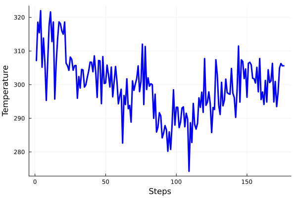

# ACE in Molly

ACE support for [Molly](https://github.com/JuliaMolSim/Molly.jl) is loaded with Julia package extensions.
To use you need to use at least v1.9 of Julia. You also need to have both Molly and ACEapi added to the environment you are using, for extension to be loaded.

You need to understand that by default Molly uses kJ/mol for energy. This is not compatible with ACEmd and AtomsCalculators, so you need to change the energy unit. ACEmd adds convenience functions to do this for you and at the same time initialize the system.

## Example

```julia
using Molly
using ACEmd

using ExtXYZ
using Unitful


# Load ACE model and initial structure
fname_ace = joinpath(pkgdir(ACEmd), "data", "TiAl.json")
fname_xyz = joinpath(pkgdir(ACEmd), "data", "TiAl-big.xyz")

data = ExtXYZ.Atoms(read_frame(fname_xyz))
pot = load_ace_model(fname_ace)

# Insert the potential to Molly and change the units
# to reflect this. Also initializes system structure.
sys = Molly.System(data, pot)

# Set up temperature and velocities
temp = 298.0u"K"
vel = random_velocities(sys, temp)

# Add initial velocities and loggers
sys = Molly.System(
    sys;
    velocities = vel,
    loggers=(temp=TemperatureLogger(100),coords=CoordinateLogger(100))
)

# Set up simulator
simulator = VelocityVerlet(
    dt=1.0u"fs",
    coupling=AndersenThermostat(temp, 1.0u"ps"),
)


# Perform MD
@time simulate!(sys, simulator, 30_000)
```

7775.936176 seconds (90.90 G allocations: 4.037 TiB, 9.11% gc time, 0.02% compilation time) 

```julia
# Plot temperature
using Plots
plot(ustrip.(sys.loggers.temp.history)[end-175:end], c="blue", linewidth=3, label=:none, ylabel="Temperature", xlabel="Steps")
savefig("Temp_TiAl_ace_md.png")
```




```julia
# Save the trajectory to the .xyz file
using JuLIP
at0 = read_extxyz(fname_xyz)[1]
AT = JuLIP.Atoms{Float64}[];
for X in sys.loggers.coords.history
    # units transform
    Xn = ustrip.(X) * 10
    at = JuLIP.Atoms(:X, Xn, cell=copy(at0.cell), pbc=true, M=copy(at0.M), Z=copy(at0.Z))
    push!(AT, at)
end
write_extxyz("TiAl_ace_md.xyz", AT)
```

Open this .xyz file in [Ovito](https://www.ovito.org/) and then export the following animation.


